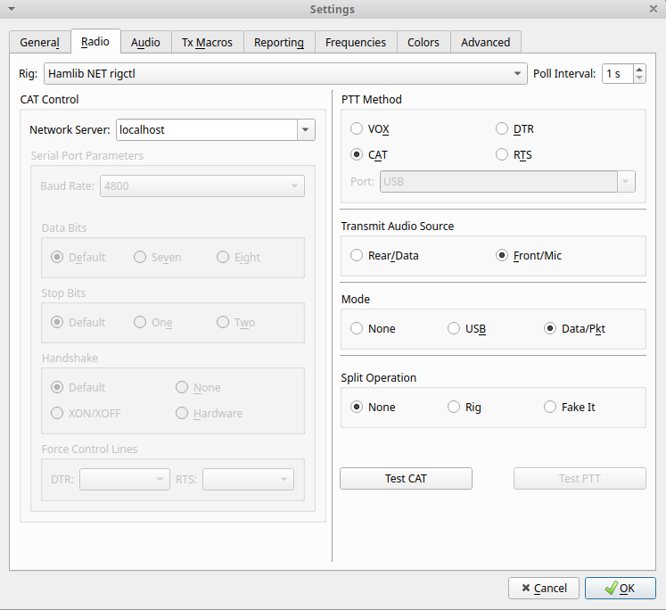
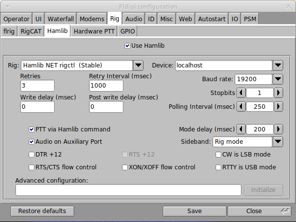

# IC-705

## How to use ICOM IC-705 remotely in Linux

- Install and setup https://github.com/nonoo/kappanhang

### WSJT-X

- Select **Radio** tab .
- For `Rig` option, select `Hamlib NET rigctl`.
- Type in the `Network Server` field the value `localhost`.

### fldigi

- On **RIG** tab then **Hamlib** tab.
- For `Rig` option, select `Hamlib NET rigctl (Stable)`.
- Type in the `Device:` field the value `localhost`.

