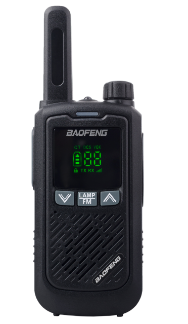

# Baofeng BF-T17

**Frequency Range** UHF 400-470MHz
**Operation Voltage** DC 3.7 V ±10%
**Operation Mode** Simplex
**Dimensions** 147mm×54mm×27mm (with Antenna)
**Weight** 130g (Battery pack included)
**RF Output Power** 2W (Max)

## Default frequencies — frecuencias de fabrica

| CHANNEL | FREQUENCY | DATA |
| --- | --- | --- |
| # 1 | 462.125  | CTCSS 69.3 |
| # 2 | 462.225 |  |
| # 3 | 462.325 |  |
| # 4 | 462.425 | CTCSS 103.5 |
| # 5 | 462.525 | CTCSS 114.8 |
| # 6 | 462.625 |  CTCSS 127.3 |
| # 7 | 462.725 | CTCSS 136.5 |
| # 8 | 462.825 | CTCSS 162.2 |
| # 9 | 462.925  | DCS 025 |
| # 10 | 463.025 | DCS 032 |
| # 11 | 463.125 | DCS 125 |
| # 12 | 463.225 | DCS 331 |
| # 13 | 463.530 | DCS 023 |
| # 14 |  |  |
| # 15 | 460.325 |  |
| # 16 |  |  |

En el [manual de la FCC](https://fcc.report/FCC-ID/2AJGM-F17/4759426.pdf) hay una tabla de frecuencias que pone los canales en los rangos de “[FRS](https://es.wikipedia.org/wiki/Family_Radio_Service)” con sus respectivas configuraciones:

[User Manual (Draft) — FCC Model: F17,BF-T17,F17G,F175M,F17Z — IC Model: F17,BF-T17](https://fcc.report/FCC-ID/2AJGM-F17/4759426.pdf)
